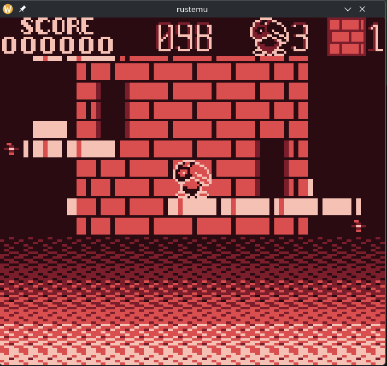
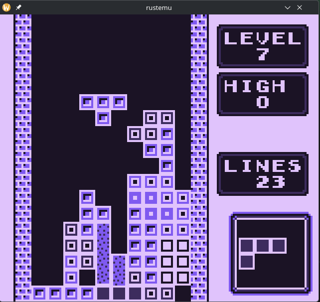
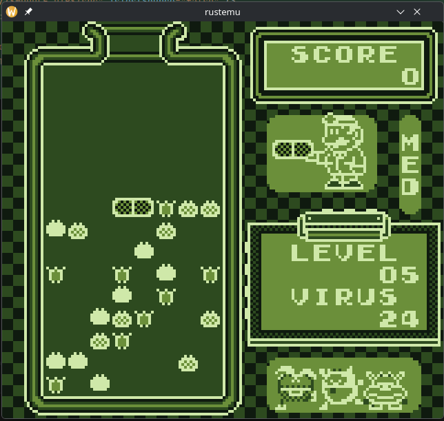
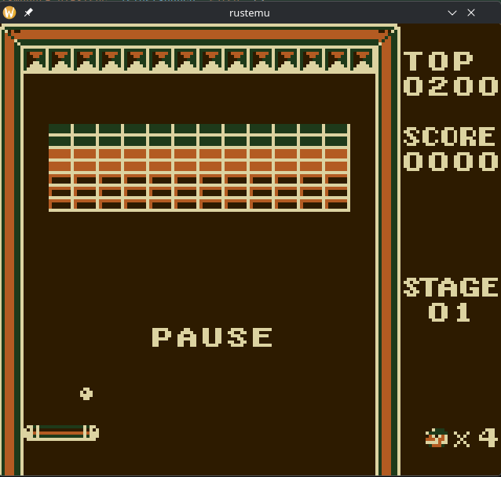

# rustemu

Gameboy DMG Emulator

  
  

  
  

## Controls
  A      => A\
  B      => B\
  Dpad   => Arrow Keys\
  Select => E\
  Start  => Space\

## What works

-   **CPU**
    - Fully implemented and verified
    - Passes all Blargg CPU test ROMs
-   **PPU**
    - Functional pixel pipeline
    - Integrated with display output
-   **Input**
    - Joypad input handling
-   **Memory**
    - RAM and Bus
    - MBC0 cartridge support
-   **Custom Color Palettes**
    - Custom RGB 4 color palette

## Build

Install Rust and Cargo for your distribution then run

    git clone https://github.com/aaron-nuy/rustemu
    cd rustemu
    cargo build --release

## Running

Run the emulator with

    cargo run --release -- \
      --palette <hex1 hex2 hex3 hex4> \
      --rom_file <path_to_romfile>

### Arguments

-   `--rom_file`\
    Path to a `.gb` ROM file

-   `--palette`\
    RGB hex colors separated by spaces ordered from lightest to darkest

Example

    cargo run --release -- \
      --palette 2d1b00 1e3a1a b35b22 dcd3a1 \
      --rom_file ./roms/tetris.gb

## TODO:

-   MBC switching
-   Audio emulation
-   Improve GPU perfomance (currently running every dot cycle)
