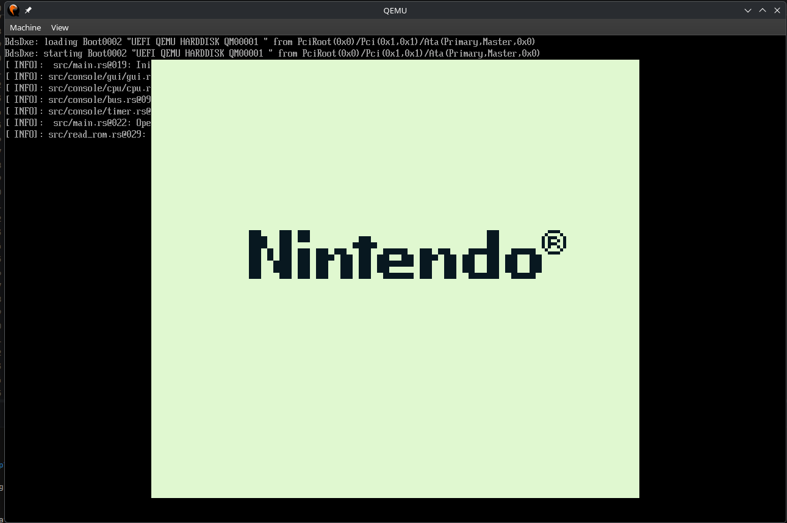

# rustemu(efi)

Gameboy DMG Emulator that can run over UEFI

The goal of this project was to learn more about rust, emulation and uefi
It's my first time using rust for anything, so please forgive any non idiomatic usage of the language.

  

  
  

  
  

## Controls
 - A      => A
 - B      => B
 - Dpad   => Arrow Keys
 - Select => E
 - Start  => Space

## What works

-   **CPU** Fully implemented and passes all Blargg's CPU tests
-   **PPU** Functional pixel pipeline along with display output
-   **Input** Joypad input handling
-   **Memory** RAM and Bus
-   **Cartridge** MBC0 cartridge support
-   **Custom Color Palettes** Custom RGB 4 color palette

## Build

Install cargo for your distribution and run

#### For your native platform
    git clone https://github.com/aaron-nuy/rustemu
    cd rustemu
    cargo build --release
#### Or for UEFI
    git clone https://github.com/aaron-nuy/rustemu
    cd rustemu
    cargo build --release --target x86_64-unknown-uefi  
    
## Running

### On host OS
Run the emulator with

    cargo run --release -- \
      --palette <hex1 hex2 hex3 hex4> \
      --rom_file <path_to_romfile>

### Arguments

-   `--rom_file`\
    Path to a `.gb` ROM file

-   `--palette`\
    RGB hex colors separated by spaces ordered from lightest to darkest

Example

    cargo run --release -- \
      --palette 2d1b00 1e3a1a b35b22 dcd3a1 \
      --rom_file ./roms/tetris.gb

### On UEFI

This can either be run on a hardware or a vm, while it is more fun to have it
running on bare metal, it's recommended to run it on a vm.

Follow [this](https://support.hpe.com/hpesc/public/docDisplay?docId=sd00005127en_us&page=GUID-D7147C7F-2016-0901-0A6A-00000000052B.html&docLocale=en_US)
tutorial to understand how to create a bootable UEFI media.

[This guide](https://krinkinmu.github.io/2020/10/11/efi-getting-started.html) explains how to use Qemu to run an EFI application.

The efi binary is located in `target/x86_64-unknown-uefi/<your_chosen_config>/rustemu.efi`

Since the UEFI version does not support command-line arguments, place the ROM in the root EFI directory and name it `default.gb`
so the emulator can automatically load it. (Make sure it's a 32KB ROM, since MBC0 is the only cartridge type supported)

## TODO:

-   MBC switching
-   Audio emulation
-   Improve GPU perfomance (currently running every dot cycle)

## Resources
- Pandocs: https://gbdev.io/pandocs/LCDC.html
- Gameboy complete technical guide: https://gekkio.fi/files/gb-docs/gbctr.pdf
- Blargg's test roms; https://github.com/retrio/gb-test-roms
- Acid2 test for ppu: https://github.com/mattcurrie/dmg-acid2
